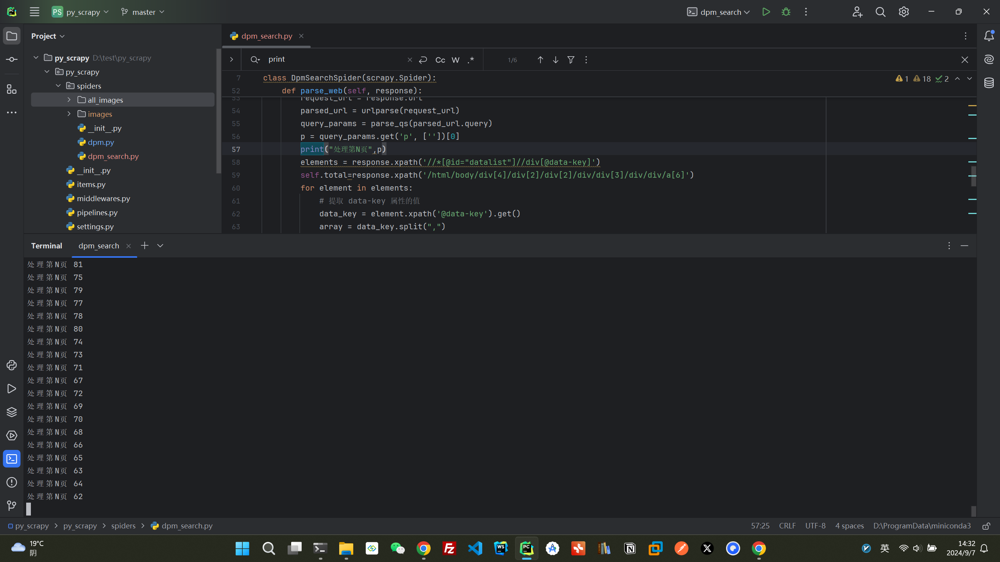
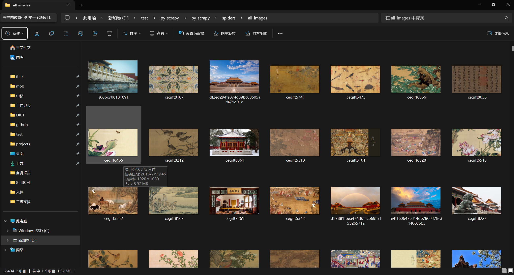

# 一键下载故宫壁纸

## 一、安装Python，Scrapy
- python环境是`python=3.11`
- 安装scrapy框架
```
pip install scrapy
```
## 二、下载仓库
```git clone https://github.com/italks/py_scrapy_dpm_wallpaper.git```
## 三、执行Scrapy爬虫
```
scrapy crawl dpm_search
```
## 四、下载路径

- 图片下载地址：项目根目录py_scrapy\spiders\all_images中


