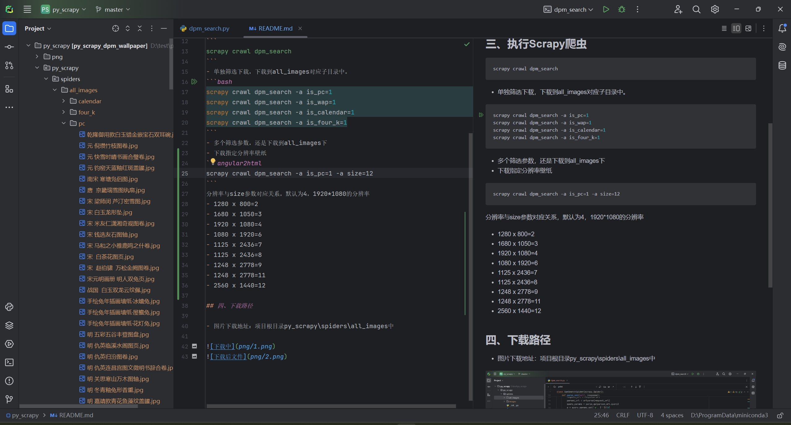

# 一键下载故宫壁纸

## 一、安装Python，Scrapy
- python环境是`python=3.11`
- 安装scrapy框架
```
pip install scrapy
```
## 二、下载仓库
```git clone https://github.com/italks/py_scrapy_dpm_wallpaper.git```
## 三、执行Scrapy爬虫
```
scrapy crawl dpm_search
```
- 单独筛选下载，下载到all_images对应子目录中。
```bash
scrapy crawl dpm_search -a is_pc=1
scrapy crawl dpm_search -a is_wap=1
scrapy crawl dpm_search -a is_calendar=1
scrapy crawl dpm_search -a is_four_k=1
```
- 多个筛选参数，还是下载到all_images下
- 下载指定分辨率壁纸
```angular2html
scrapy crawl dpm_search -a is_pc=1 -a size=12
```
分辨率与size参数对应关系，默认为4，1920*1080的分辨率
- 1280 x 800=2
- 1680 x 1050=3
- 1920 x 1080=4
- 1080 x 1920=6
- 1125 x 2436=7
- 1125 x 2436=8
- 1248 x 2778=9
- 1248 x 2778=11
- 2560 x 1440=12

## 四、下载路径

- 图片下载地址：项目根目录py_scrapy\spiders\all_images中




## 五、版权声明

图片版权归`http://www.dpm.org.cn`所有，不得商用。

任何单位或个人在以转载、引用、摘编、下载等方式使用本网站内容时，均须注明作者，并标明图片、文章的出处为“故宫博物院网站”或`http://www.dpm.org.cn`。未经故宫博物院或相关权利人的书面许可，不得修改所使用的内容。[故宫博物院](https://www.dpm.org.cn/bottom/privacy/236341.html)
